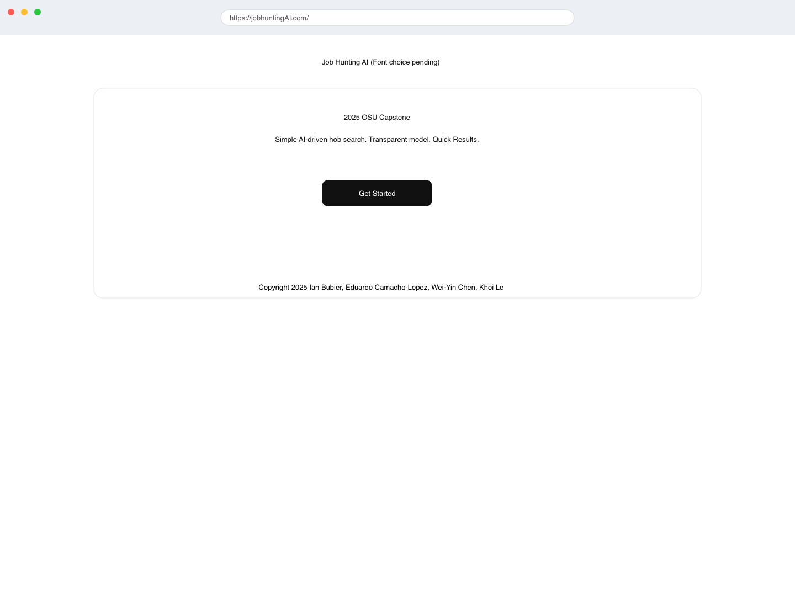
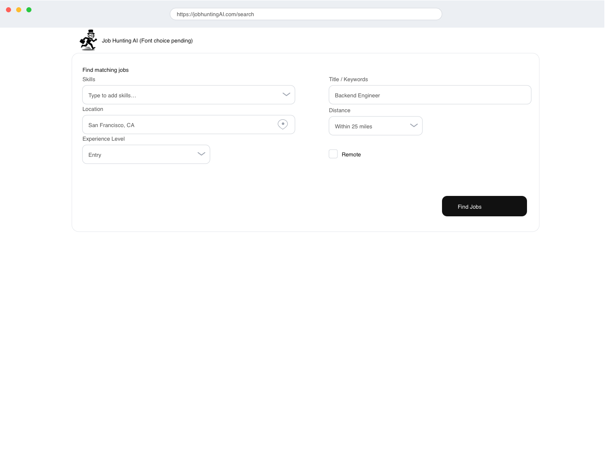
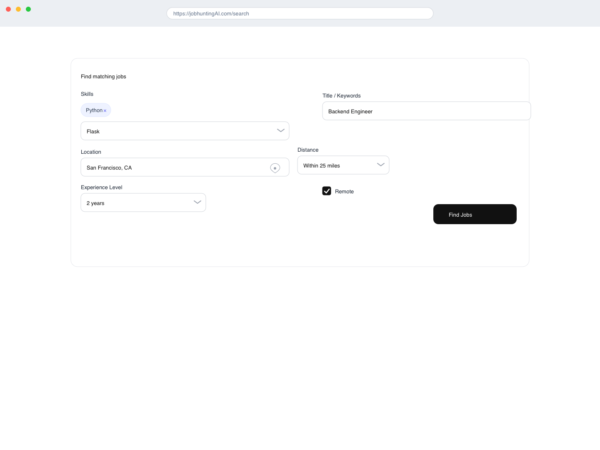
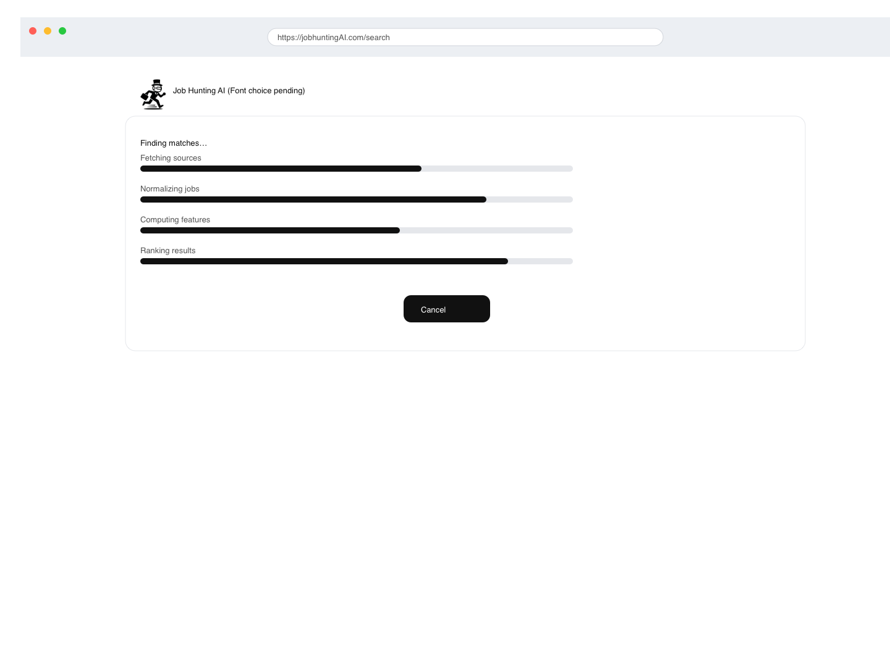
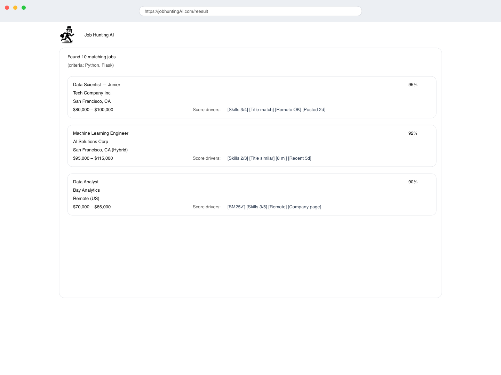

# Technical Design Document
## Job Hunting AI Web Tool

**Version:** 1.0  
**Date:** October 2025  
**Project:** CS 467 Capstone Project  
**Team:** 4 Members (5-week sprint)

---

## Table of Contents
1. [Document Overview](#document-overview)
2. [System Architecture](#system-architecture)
3. [Component Design](#component-design)
4. [Data Flow](#data-flow)
5. [API Specifications](#api-specifications)
6. [Machine Learning Design](#machine-learning-design)
7. [Database Design](#database-design)
8. [Security Considerations](#security-considerations)
9. [Deployment Architecture](#deployment-architecture)
10. [Testing Strategy](#testing-strategy)
11. [Appendices](#appendices)

---

## 1. Document Overview

### 1.1 Purpose
This document provides comprehensive technical specifications for the Job Hunting AI Web Tool, detailing system architecture, component interactions, API contracts, and implementation guidelines for the development team.

### 1.2 Scope
This design covers the MVP (Minimum Viable Product) to be delivered within 5 weeks, focusing on core job matching functionality using semantic AI technology.

### 1.3 Intended Audience
- Development team members
- Project stakeholders
- Future maintainers
- Technical reviewers

### 1.4 Definitions and Acronyms
- **MVP**: Minimum Viable Product
- **NLP**: Natural Language Processing
- **SBERT**: Sentence-BERT (Sentence Bidirectional Encoder Representations from Transformers)
- **API**: Application Programming Interface
- **REST**: Representational State Transfer
- **CORS**: Cross-Origin Resource Sharing

---

## 2. System Architecture

### 2.1 High-Level Architecture

```
┌─────────────────────────────────────────────────────────────┐
│                         User Browser                        │
│  ┌────────────────────────────────────────────────────────┐ │
│  │              Frontend (HTML/CSS/JS)                    │ │
│  │  - User Input Form                                     │ │
│  │  - Results Display                                     │ │
│  │  - Error Handling UI                                   │ │
│  └─────────────────────┬──────────────────────────────────┘ │
└────────────────────────┼────────────────────────────────────┘
                         │ HTTPS/JSON
                         ▼
┌─────────────────────────────────────────────────────────────┐
│                    Backend Server (Flask)                   │
│  ┌──────────────────────────────────────────────────────┐   │
│  │              API Routes Layer                        │   │
│  │  /api/search        /api/health                      │   │
│  └────────────┬─────────────────────────────────────────┘   │
│               │                                             │
│  ┌────────────┴─────────────────────────────────────────┐   │
│  │         Business Logic Layer                         │   │
│  │  - Request Validation                                │   │
│  │  - Response Formatting                               │   │
│  │  - Error Handling                                    │   │
│  └────────┬──────────────────────┬──────────────────────┘   │
│           │                      │                          │
│  ┌────────┴────────────┐  ┌──────┴──────────────────────┐   │
│  │   ML Engine         │  │   External API Client       │   │
│  │  - SBERT Model      │  │  - Adzuna Integration       │   │
│  │  - Similarity Calc  │  │  - Rate Limiting            │   │
│  │  - Ranking          │  │  - Cache Layer              │   │
│  └─────────────────────┘  └─────────────────────────────┘   │
└─────────────────────────────────────────────────────────────┘
                         │
                         ▼
              ┌──────────────────────┐
              │   Adzuna Job API     │
              │  (External Service)  │
              └──────────────────────┘
```

### 2.2 Architecture Patterns

**Pattern**: Layered Architecture (3-tier)
- **Presentation Layer**: Frontend (HTML/CSS/JS)
- **Application Layer**: Flask Backend + ML Engine
- **Data Layer**: External API (Adzuna)

**Rationale**: 
- Clear separation of concerns
- Easier testing and maintenance
- Supports future scalability
- Appropriate for 5-week timeline

### 2.3 Technology Stack

| Layer | Technology | Version | Purpose |
|-------|-----------|---------|---------|
| Frontend | HTML5/CSS3 | - | User interface structure |
| Frontend | Vanilla JavaScript | ES6+ | Client-side logic |
| Backend | Python | 3.9+ | Server-side processing |
| Framework | Flask | 2.3+ | Web framework |
| ML Library | sentence-transformers | 2.2+ | Semantic similarity |
| ML Model | all-MiniLM-L6-v2 | - | Lightweight SBERT model |
| HTTP Client | requests | 2.31+ | External API calls |
| Deployment | Render | - | Cloud hosting |

---

## 3. Component Design

### 3.1 Frontend Component

#### 3.1.1 Structure
```
frontend/
├── index.html          # Main application page
├── css/
│   ├── styles.css      # Main stylesheet
│   └── responsive.css  # Media queries
├── js/
│   ├── app.js          # Main application logic
│   ├── api.js          # API communication
│   └── ui.js           # UI manipulation
└── assets/
    └── images/         # Logo, icons
```

#### 3.1.2 Key Components

**Search Form Component**
```javascript
class SearchForm {
  constructor(formElement) {
    this.form = formElement;
    this.fields = {
      skills: '',
      keywords: '',
      location: '',
      experience: 'entry'
    };
  }
  
  validate() {
    // Validation logic
  }
  
  getFormData() {
    // Returns formatted JSON
  }
  
  handleSubmit(callback) {
    // Submit handler
  }
}
```

**Results Display Component**
```javascript
class ResultsDisplay {
  constructor(containerElement) {
    this.container = containerElement;
    this.jobs = [];
  }
  
  render(jobs) {
    // Renders job cards
  }
  
  showLoading() {
    // Loading state
  }
  
  showError(message) {
    // Error state
  }
}
```

#### 3.1.3 User Interface Mockup

#### Landing


#### Search Form


#### Search Form — Interactions


#### Loading / Generating


#### Results Page


### 3.2 Backend Component

#### 3.2.1 Project Structure
```
backend/
├── __init__.py
├── app.py                 # Flask application entry
├── config.py              # Configuration management
├── download_model.py      # Preload ML model
├── requirements.txt       # Python dependencies
├── runtime.txt
├── routes/
│   ├── __init__.py
│   └── job_routes.py      # API endpoints
├── services/
│   ├── __init__.py
│   ├── adzuna_service.py  # External API integration
│   ├── ml_service.py      # ML model integration
│   └── matching_service.py # Job matching logic
├── models/
│   ├── __init__.py
│   └── job_model.py       # Data models
├── utils/
│   ├── __init__.py
│   ├── validators.py      # Input validation
│   └── formatters.py      # Response formatting
└── tests/
│   ├── __init__.py
│   ├── test_adzuna_service.py
│   ├── test_matching_service.py
│   ├── test_ml_service.py
│   ├── test_routes.py
│   ├── test_validators.py
    └── test_api.py
```

#### 3.2.2 Core Classes

**Flask Application (app.py)**
```python
from flask import Flask
from flask_cors import CORS
from routes.job_routes import job_bp

app = Flask(__name__)
CORS(app)

# Configuration
app.config.from_object('config.Config')

# Register blueprints
app.register_blueprint(job_bp, url_prefix='/api')

@app.route('/health')
def health_check():
    return {'status': 'healthy', 'version': '1.0'}
```

**Job Model (models/job_model.py)**
```python
from dataclasses import dataclass
from typing import List, Optional


@dataclass
class Job:
    id: str
    title: str
    company: str
    location: str
    description: str
    salary_min: Optional[float] = None
    salary_max: Optional[float] = None
    url: str = ""
    posted_date: str = ""

    def to_dict(self):
        return {
            "id": self.id,
            "title": self.title,
            "company": self.company,
            "location": self.location,
            "description": self.description,
            "salary": self.format_salary(),
            "url": self.url,
            "posted_date": self.posted_date,
        }

    def format_salary(self):
        if self.salary_min and self.salary_max:
            return f"${self.salary_min:,.0f} - ${self.salary_max:,.0f}"
        return "Not specified"


@dataclass
class MatchedJob:
    job: Job
    similarity_score: float
    matching_skills: List[str]
    final_score: float

    def to_dict(self):
        return {
            **self.job.to_dict(),
            "similarity_score": round(self.similarity_score * 100, 2),
            "matching_skills": self.matching_skills,
            "final_score": round(self.final_score * 100, 2),
        }
```

### 3.3 Machine Learning Component

#### 3.3.1 ML Service Design

**ML Service Class (services/ml_service.py)**
```python
from sentence_transformers import SentenceTransformer
import numpy as np
from typing import List


class MLService:
    def __init__(self, model_name: str = "all-MiniLM-L6-v2"):
        """
        Initialize with lightweight SBERT model
        Model size: 82MB, inference time: ~10ms per text
        384-dimensional embeddings
        """
        self.model = SentenceTransformer(model_name)
        self._cache = {}  # Cache for frequent queries, format - {hash(text): embedding}
        self.max_cache_size = 1000  # Limit cache size to avoid excessive memory use

    def encode_text(self, text: str) -> np.ndarray:
        """
        Generate embedding for input text
        Args:
            text: input string to encode
        Returns:
            a 384-dimensional numpy array
        """
        cache_key = hash(text)
        if cache_key in self._cache:
            return self._cache[cache_key]

        embedding = self.model.encode(
            text, convert_to_numpy=True, normalize_embeddings=True
        )

        # Simple cache eviction policy: remove oldest entry if cache is full
        if len(self._cache) >= self.max_cache_size:
            self._cache.pop(next(iter(self._cache)))
        self._cache[cache_key] = embedding
        return embedding

    def calculate_similarity(self, emb1: np.ndarray, emb2: np.ndarray) -> float:
        """
        Calculate cosine similarity between two embeddings
        Args:
            emb1: first embedding
            emb2: second embedding
        Returns:
            similarity score between [0.0, 1.0]
        """
        return float(np.dot(emb1, emb2))

    def batch_similarity(
        self, query_emb: np.ndarray, job_embs: List[np.ndarray]
    ) -> List[float]:
        """
        Calculate similarity for multiple jobs efficiently
        Args:
            query_emb: user profile embedding
            job_embs: list of job embeddings
        Returns:
            list of similarity scores
        """
        if not job_embs:
            return []
        job_matrix = np.vstack(job_embs)  # Shape: (num_jobs, embedding_dim)
        dot_products = np.dot(job_matrix, query_emb)  # Shape: (num_jobs,)
        return dot_products.tolist()
```

#### 3.3.2 Matching Service

**Matching Service (services/matching_service.py)**
```python
from typing import List, Dict
from backend.models.job_model import Job, MatchedJob
from backend.services.ml_service import MLService
import re


class MatchingService:
    def __init__(self, ml_service: MLService):
        self.ml_service = ml_service

    def create_user_profile(
        self, skills: List[str], keywords: str, experience: str
    ) -> str:
        """
        Create comprehensive user profile text for embedding
        Args:
            skills: list of user skills
            keywords: job keywords user is interested in
            experience: experience level ("entry", "mid", "senior")
        Returns:
            concatenated string
        """
        profile_parts = []

        if skills:
            profile_parts.append(f"Skills: {', '.join(skills)}")

        if keywords:
            profile_parts.append(f"Looking for: {keywords}")

        experience_map = {
            "entry": "Entry level position, 0-2 years experience",
            "mid": "Mid-level position, 3-5 years experience",
            "senior": "Senior position, 5+ years experience",
        }
        profile_parts.append(experience_map.get(experience, ""))

        return " ".join([p for p in profile_parts if p])

    def create_job_profile(self, job: Job) -> str:
        """
        Create comprehensive job description for embedding
        Args:
            job: Job object
        Returns:
            concatenated string
        """
        desc = job.description[:500] if len(job.description) > 500 else job.description
        return f"{job.title} at {job.company}. {desc}"

    def extract_matching_skills(
        self, user_skills: List[str], job_description: str
    ) -> List[str]:
        """
        Find which user skills appear in job description
        Args:
            user_skills: list of user skills
            job_description: full job description text
        Returns:
            list of matching skills
        """
        job_lower = job_description.lower()
        matching = []

        for skill in user_skills:
            skill_lower = skill.lower()
            # For skills with special chars (C++, C#, .NET), use simpler match
            if re.search(r"[^a-zA-Z0-9\s]", skill):
                # Direct substring search for special-char skills
                if skill_lower in job_lower:
                    matching.append(skill)
            else:
                # Use word boundaries for alphanumeric skills to avoid partial matches
                pattern = r"\b" + re.escape(skill_lower) + r"\b"
                if re.search(pattern, job_lower):
                    matching.append(skill)

        return matching

    def rank_jobs(
        self, user_data: Dict, jobs: List[Job], top_k: int = 20
    ) -> List[MatchedJob]:
        """
        Main ranking function using semantic similarity and skills matching
        Args:
            user_data: dict with keys "skills", "keywords", "experience"
            jobs: list of Job objects to rank
            top_k: number of top jobs to return
        Returns:
            list of MatchedJob objects with similarity scores and matching skills,
            sorted by final score
        """
        if not jobs:
            return []

        # Create user profile embedding
        user_profile = self.create_user_profile(
            user_data.get("skills", []),
            user_data.get("keywords", ""),
            user_data.get("experience", "entry"),
        )
        user_embedding = self.ml_service.encode_text(user_profile)

        # Create job embeddings
        job_profiles = [self.create_job_profile(job) for job in jobs]
        job_embeddings = [
            self.ml_service.encode_text(profile) for profile in job_profiles
        ]

        # Calculate similarities
        similarities = self.ml_service.batch_similarity(user_embedding, job_embeddings)

        # Create matched jobs with scores
        matched_jobs = []
        for job, similarity in zip(jobs, similarities):
            matching_skills = self.extract_matching_skills(
                user_data.get("skills", []), job.description
            )

            skills_match_ratio = (
                (len(matching_skills) / len(user_data.get("skills", [])))
                if user_data.get("skills", [])
                else 0
            )

            final_score = (0.8 * similarity) + (0.2 * skills_match_ratio)

            matched_jobs.append(
                MatchedJob(
                    job=job,
                    similarity_score=similarity,
                    matching_skills=matching_skills,
                    final_score=final_score,
                )
            )

        # Sort by final_score and return top K
        matched_jobs.sort(key=lambda x: x.final_score, reverse=True)
        return matched_jobs[:top_k]
```

### 3.4 External API Integration

#### 3.4.1 Adzuna Service

**Adzuna Service (services/adzuna_service.py)**
```python
import requests
from typing import List, Dict, Optional
from models.job_model import Job
import time

class AdzunaService:
    BASE_URL = "https://api.adzuna.com/v1/api/jobs"
    
    def __init__(self, app_id: str, app_key: str, country: str = 'us'):
        self.app_id = app_id
        self.app_key = app_key
        self.country = country
        self.rate_limit_delay = 0.1  # 100ms between requests
        self.last_request_time = 0
    
    def _rate_limit(self):
        """Simple rate limiting"""
        elapsed = time.time() - self.last_request_time
        if elapsed < self.rate_limit_delay:
            time.sleep(self.rate_limit_delay - elapsed)
        self.last_request_time = time.time()
    
    def search_jobs(self,
                   keywords: str,
                   location: str,
                   max_results: int = 50,
                   page: int = 1) -> List[Job]:
        """
        Search for jobs using Adzuna API
        
        Args:
            keywords: Search query
            location: Location string
            max_results: Maximum number of results
            page: Page number
        
        Returns:
            List of Job objects
        """
        self._rate_limit()
        
        url = f"{self.BASE_URL}/{self.country}/search/{page}"
        
        params = {
            'app_id': self.app_id,
            'app_key': self.app_key,
            'results_per_page': min(max_results, 50),
            'what': keywords,
            'where': location,
            'content-type': 'application/json'
        }
        
        try:
            response = requests.get(url, params=params, timeout=10)
            response.raise_for_status()
            data = response.json()
            
            return self._parse_jobs(data.get('results', []))
            
        except requests.exceptions.RequestException as e:
            print(f"Error fetching jobs: {e}")
            return []
    
    def _parse_jobs(self, raw_jobs: List[Dict]) -> List[Job]:
        """Convert Adzuna API response to Job objects"""
        jobs = []
        
        for raw_job in raw_jobs:
            try:
                job = Job(
                    id=raw_job.get('id', ''),
                    title=raw_job.get('title', 'Untitled'),
                    company=raw_job.get('company', {}).get('display_name', 'Unknown'),
                    location=raw_job.get('location', {}).get('display_name', 'Unknown'),
                    description=raw_job.get('description', ''),
                    salary_min=raw_job.get('salary_min'),
                    salary_max=raw_job.get('salary_max'),
                    url=raw_job.get('redirect_url', ''),
                    posted_date=raw_job.get('created', '')
                )
                jobs.append(job)
            except Exception as e:
                print(f"Error parsing job: {e}")
                continue
        
        return jobs
```

---

## 4. Data Flow

### 4.1 Job Search Flow

```
1. User enters search criteria in frontend form
   ↓
2. Frontend validates input and sends POST to /api/search
   ↓
3. Backend validates request payload
   ↓
4. Adzuna Service fetches raw job listings
   ↓
5. ML Service creates embeddings for:
   - User profile (skills + keywords + experience)
   - Each job description
   ↓
6. Matching Service calculates similarity scores
   ↓
7. Jobs ranked by similarity score
   ↓
8. Top 20 jobs formatted and returned to frontend
   ↓
9. Frontend displays results with match percentages
```

### 4.2 Sequence Diagram

```
User          Frontend        Backend         Adzuna API      ML Engine
 |               |               |                |              |
 |--Submit Form->|               |                |              |
 |               |--POST /api/-->|                |              |
 |               |    search     |                |              |
 |               |               |--Get Jobs----->|              |
 |               |               |<--Job Data-----|              |
 |               |               |                |              |
 |               |               |--Encode User-->|              |
 |               |               |  Profile       |              |
 |               |               |<--Embedding----|              |
 |               |               |                |              |
 |               |               |--Encode Jobs-->|              |
 |               |               |<--Embeddings---|              |
 |               |               |                |              |
 |               |               |--Calculate---->|              |
 |               |               |  Similarity    |              |
 |               |               |<--Scores-------|              |
 |               |               |                |              |
 |               |<--Ranked Jobs-|                |              |
 |<--Display-----|               |                |              |
 |   Results     |               |                |              |
```

### 4.3 Data Models

#### 4.3.1 Request/Response Schemas

**Search Request:**
```json
{
  "skills": ["Python", "Machine Learning", "SQL"],
  "keywords": "Data Scientist",
  "location": "San Francisco, CA",
  "experience": "entry",
  "max_results": 20
}
```

**Search Response:**
```json
{
  "success": true,
  "count": 20,
  "results": [
    {
      "id": "12345",
      "title": "Junior Data Scientist",
      "company": "Tech Corp",
      "location": "San Francisco, CA",
      "description": "We are seeking...",
      "salary": "$80,000 - $100,000",
      "url": "https://...",
      "posted_date": "2025-10-01",
      "match_score": 95.3,
      "matching_skills": ["Python", "Machine Learning"]
    }
  ]
}
```

**Error Response:**
```json
{
  "success": false,
  "error": {
    "code": "VALIDATION_ERROR",
    "message": "Skills must be a non-empty array",
    "field": "skills"
  }
}
```

---

## 5. API Specifications

### 5.1 RESTful Endpoints

#### 5.1.1 Health Check
```
GET /health
```

**Response:**
```json
{
  "status": "healthy",
  "version": "1.0",
  "timestamp": "2025-10-07T10:30:00Z"
}
```

#### 5.1.2 Job Search
```
POST /api/search
Content-Type: application/json
```

**Request Body:**
```json
{
  "skills": ["string"],
  "keywords": "string",
  "location": "string",
  "experience": "entry|mid|senior",
  "max_results": 20
}
```

**Validation Rules:**
- `skills`: Array of strings, at least 1 skill required
- `keywords`: String, minimum 3 characters
- `location`: String, minimum 2 characters
- `experience`: Must be one of: "entry", "mid", "senior"
- `max_results`: Integer between 1 and 50, default 20

**Success Response (200):**
```json
{
  "success": true,
  "count": 15,
  "query_time_ms": 850,
  "results": [/* array of MatchedJob */]
}
```

**Error Responses:**

**400 Bad Request:**
```json
{
  "success": false,
  "error": {
    "code": "VALIDATION_ERROR",
    "message": "Invalid input",
    "details": {
      "skills": "At least one skill is required"
    }
  }
}
```

**500 Internal Server Error:**
```json
{
  "success": false,
  "error": {
    "code": "INTERNAL_ERROR",
    "message": "An unexpected error occurred"
  }
}
```

**503 Service Unavailable:**
```json
{
  "success": false,
  "error": {
    "code": "EXTERNAL_API_ERROR",
    "message": "Job API temporarily unavailable"
  }
}
```

### 5.2 API Route Implementation

**routes/job_routes.py:**
```python
from flask import Blueprint, request, jsonify
from services.adzuna_service import AdzunaService
from services.ml_service import MLService
from services.matching_service import MatchingService
from utils.validators import validate_search_request
import time

job_bp = Blueprint('jobs', __name__)

# Initialize services (in production, use dependency injection)
ml_service = MLService()
matching_service = MatchingService(ml_service)
adzuna_service = AdzunaService(
    app_id=os.getenv('ADZUNA_APP_ID'),
    app_key=os.getenv('ADZUNA_APP_KEY')
)

@job_bp.route('/search', methods=['POST'])
def search_jobs():
    start_time = time.time()
    
    try:
        # Validate request
        data = request.get_json()
        is_valid, error = validate_search_request(data)
        if not is_valid:
            return jsonify({
                'success': False,
                'error': error
            }), 400
        
        # Fetch jobs from Adzuna
        jobs = adzuna_service.search_jobs(
            keywords=data.get('keywords', ''),
            location=data.get('location', ''),
            max_results=data.get('max_results', 50)
        )
        
        if not jobs:
            return jsonify({
                'success': True,
                'count': 0,
                'results': [],
                'message': 'No jobs found matching criteria'
            })
        
        # Rank jobs using ML
        matched_jobs = matching_service.rank_jobs(
            user_data=data,
            jobs=jobs,
            top_k=data.get('max_results', 20)
        )
        
        # Format response
        query_time = int((time.time() - start_time) * 1000)
        
        return jsonify({
            'success': True,
            'count': len(matched_jobs),
            'query_time_ms': query_time,
            'results': [job.to_dict() for job in matched_jobs]
        })
        
    except Exception as e:
        print(f"Error in search endpoint: {e}")
        return jsonify({
            'success': False,
            'error': {
                'code': 'INTERNAL_ERROR',
                'message': 'An unexpected error occurred'
            }
        }), 500
```

---

## 6. Machine Learning Design

### 6.1 Model Selection Rationale

**Chosen Model:** `all-MiniLM-L6-v2`

**Specifications:**
- Architecture: Sentence-BERT (distilled from MiniLM)
- Embedding Dimension: 384
- Model Size: ~80MB
- Inference Speed: ~10ms per sentence (CPU)
- Performance: 82.37% on STS benchmark

**Why This Model:**
1. **Lightweight**: Fast inference suitable for web deployment
2. **Pre-trained**: No training required, saves development time
3. **Proven**: Widely used in production systems
4. **Quality**: Excellent semantic understanding for job matching
5. **Open-source**: Free commercial use

**Alternatives Considered:**
- `all-mpnet-base-v2`: Better accuracy but 3x larger (420MB), slower
- `all-distilroberta-v1`: Similar size but slightly lower performance
- Custom BERT fine-tuning: Would require labeled data and training time

### 6.2 Semantic Similarity Algorithm

#### 6.2.1 Embedding Generation

**Process:**
1. Tokenize input text using pre-trained tokenizer
2. Pass through transformer layers
3. Apply mean pooling over token embeddings
4. Normalize to unit length
5. Output: 384-dimensional vector

**Code:**
```python
def encode_text(self, text: str) -> np.ndarray:
    """
    text -> [384-dim vector]
    Normalized to unit length for cosine similarity
    """
    embedding = self.model.encode(
        text,
        convert_to_numpy=True,
        normalize_embeddings=True
    )
    return embedding
```

#### 6.2.2 Similarity Calculation

**Cosine Similarity Formula:**
```
similarity = (A · B) / (||A|| × ||B||)

Where:
- A, B are embedding vectors
- · is dot product
- ||·|| is Euclidean norm
- Result range: [-1, 1], mapped to [0, 1] for display
```

**Properties:**
- 1.0 = Perfect match (identical semantic meaning)
- 0.5 = Moderate similarity
- 0.0 = No similarity

**Implementation:**
```python
def calculate_similarity(self, emb1, emb2):
    # Vectors are already normalized, so just dot product
    return float(np.dot(emb1, emb2))
```

### 6.3 Ranking Strategy

#### 6.3.1 Multi-Factor Scoring

**Final Score Components:**
1. **Semantic Similarity (80% weight)**: ML-based text similarity
2. **Keyword Matching (20% weight)**: Exact skill matches

**Formula:**
```python
final_score = (0.8 × semantic_similarity) + (0.2 × skills_match_ratio)

where:
skills_match_ratio = matched_skills / total_user_skills
```

**Example:**
```
User skills: ["Python", "SQL", "Machine Learning"]
Job description contains: "Python" and "SQL"

semantic_similarity = 0.85
keyword_match_ratio = 2/3 = 0.67

final_score = (0.8 × 0.85) + (0.2 × 0.67) = 0.814 = 81.4%
```

#### 6.3.2 Performance Optimization

**Batch Processing:**
```python
# Instead of individual comparisons:
for job in jobs:
    similarity = calculate_similarity(user_emb, job_emb)

# Use vectorized operations:
job_matrix = np.vstack([job.embedding for job in jobs])
similarities = np.dot(job_matrix, user_embedding)  # Single operation
```

**Expected Performance:**
- 50 jobs: ~50ms total encoding + 5ms similarity calculation
- Total latency target: < 2 seconds (including API call)

**Caching Strategy:**
```python
class MLService:
    def __init__(self):
        self.model = SentenceTransformer('all-MiniLM-L6-v2')
        self._embedding_cache = {}  # Cache for frequent queries
        self.max_cache_size = 1000
    
    def encode_with_cache(self, text: str) -> np.ndarray:
        cache_key = hash(text)
        if cache_key in self._embedding_cache:
            return self._embedding_cache[cache_key]
        
        embedding = self.model.encode(text)
        
        # Simple LRU-style cache management
        if len(self._embedding_cache) >= self.max_cache_size:
            # Remove oldest entry
            self._embedding_cache.pop(next(iter(self._embedding_cache)))
        
        self._embedding_cache[cache_key] = embedding
        return embedding
```

---

## 7. Database Design

### 7.1 MVP Approach: No Database

For the 5-week MVP, we will **NOT** implement a persistent database. This decision is based on:

**Rationale:**
1. **Time constraints**: Database design, setup, and management would consume 10-15 hours
2. **MVP scope**: Core functionality doesn't require data persistence
3. **Simplicity**: Reduces deployment complexity and maintenance overhead
4. **External API**: Adzuna provides real-time data, eliminating need for local storage

**Data Flow Without Database:**
```
User Request → Backend API → External API → Real-time Processing → Response
                    ↓
              ML Processing
                    ↓
              Ranking & Filtering
```

### 7.2 Future Database Design (Post-MVP)

For production scaling, a database would be beneficial:

**Proposed Schema (PostgreSQL):**

```sql
-- Users table (for future user accounts)
CREATE TABLE users (
    id SERIAL PRIMARY KEY,
    email VARCHAR(255) UNIQUE NOT NULL,
    created_at TIMESTAMP DEFAULT CURRENT_TIMESTAMP
);

-- Saved searches
CREATE TABLE saved_searches (
    id SERIAL PRIMARY KEY,
    user_id INTEGER REFERENCES users(id),
    skills TEXT[],
    keywords VARCHAR(500),
    location VARCHAR(200),
    experience_level VARCHAR(20),
    created_at TIMESTAMP DEFAULT CURRENT_TIMESTAMP
);

-- Cached jobs (reduce API calls)
CREATE TABLE cached_jobs (
    id VARCHAR(100) PRIMARY KEY,
    title VARCHAR(500),
    company VARCHAR(200),
    location VARCHAR(200),
    description TEXT,
    salary_min DECIMAL(10,2),
    salary_max DECIMAL(10,2),
    url TEXT,
    posted_date TIMESTAMP,
    cached_at TIMESTAMP DEFAULT CURRENT_TIMESTAMP,
    embedding VECTOR(384)  -- Using pgvector extension
);

-- Search history
CREATE TABLE search_history (
    id SERIAL PRIMARY KEY,
    user_id INTEGER REFERENCES users(id),
    search_params JSONB,
    result_count INTEGER,
    created_at TIMESTAMP DEFAULT CURRENT_TIMESTAMP
);
```

### 7.3 Caching Strategy (MVP)

**In-Memory Caching:**

```python
from functools import lru_cache
from datetime import datetime, timedelta

class CacheManager:
    def __init__(self, ttl_minutes=30):
        self.cache = {}
        self.ttl = timedelta(minutes=ttl_minutes)
    
    def get(self, key: str):
        if key in self.cache:
            data, timestamp = self.cache[key]
            if datetime.now() - timestamp < self.ttl:
                return data
            else:
                del self.cache[key]
        return None
    
    def set(self, key: str, value):
        self.cache[key] = (value, datetime.now())
    
    def clear_expired(self):
        now = datetime.now()
        expired = [k for k, (_, ts) in self.cache.items() 
                   if now - ts >= self.ttl]
        for k in expired:
            del self.cache[k]

# Usage in Adzuna Service
cache_manager = CacheManager(ttl_minutes=30)

def search_jobs_cached(self, keywords, location, max_results):
    cache_key = f"{keywords}:{location}:{max_results}"
    
    # Check cache first
    cached_result = cache_manager.get(cache_key)
    if cached_result:
        return cached_result
    
    # Fetch from API
    jobs = self.search_jobs(keywords, location, max_results)
    
    # Cache results
    cache_manager.set(cache_key, jobs)
    
    return jobs
```

---

## 8. Security Considerations

### 8.1 API Key Management

**Environment Variables:**
```python
# config.py
import os
from dotenv import load_dotenv

load_dotenv()

class Config:
    # API Keys - NEVER commit to repository
    ADZUNA_APP_ID = os.getenv('ADZUNA_APP_ID')
    ADZUNA_APP_KEY = os.getenv('ADZUNA_APP_KEY')
    
    # Flask settings
    SECRET_KEY = os.getenv('SECRET_KEY', 'dev-secret-key-change-in-production')
    DEBUG = os.getenv('FLASK_DEBUG', 'False').lower() == 'true'
    
    # Security headers
    SESSION_COOKIE_SECURE = True
    SESSION_COOKIE_HTTPONLY = True
    SESSION_COOKIE_SAMESITE = 'Lax'
```

**.env file (NOT in Git):**
```
ADZUNA_APP_ID=your_app_id_here
ADZUNA_APP_KEY=your_app_key_here
SECRET_KEY=your_secret_key_here
FLASK_DEBUG=False
```

**.gitignore:**
```
.env
__pycache__/
*.pyc
venv/
.DS_Store
```

### 8.2 Input Validation and Sanitization

**Validation Module (utils/validators.py):**
```python
import re
from typing import Dict, Tuple, Optional

def validate_search_request(data: Dict) -> Tuple[bool, Optional[Dict]]:
    """
    Validate search request data
    Returns: (is_valid, error_dict)
    """
    errors = {}
    
    # Validate skills
    skills = data.get('skills', [])
    if not isinstance(skills, list):
        errors['skills'] = 'Skills must be an array'
    elif len(skills) == 0:
        errors['skills'] = 'At least one skill is required'
    elif len(skills) > 20:
        errors['skills'] = 'Maximum 20 skills allowed'
    else:
        # Validate each skill
        for skill in skills:
            if not isinstance(skill, str):
                errors['skills'] = 'All skills must be strings'
                break
            if len(skill) < 2 or len(skill) > 50:
                errors['skills'] = 'Skills must be 2-50 characters'
                break
            if not re.match(r'^[a-zA-Z0-9\s\+\#\.\-]+, skill):
                errors['skills'] = 'Skills contain invalid characters'
                break
    
    # Validate keywords
    keywords = data.get('keywords', '')
    if not isinstance(keywords, str):
        errors['keywords'] = 'Keywords must be a string'
    elif len(keywords) < 3:
        errors['keywords'] = 'Keywords must be at least 3 characters'
    elif len(keywords) > 200:
        errors['keywords'] = 'Keywords must be less than 200 characters'
    
    # Validate location
    location = data.get('location', '')
    if not isinstance(location, str):
        errors['location'] = 'Location must be a string'
    elif len(location) < 2:
        errors['location'] = 'Location must be at least 2 characters'
    elif len(location) > 100:
        errors['location'] = 'Location must be less than 100 characters'
    
    # Validate experience
    experience = data.get('experience', 'entry')
    valid_levels = ['entry', 'mid', 'senior']
    if experience not in valid_levels:
        errors['experience'] = f'Experience must be one of: {", ".join(valid_levels)}'
    
    # Validate max_results
    max_results = data.get('max_results', 20)
    if not isinstance(max_results, int):
        errors['max_results'] = 'max_results must be an integer'
    elif max_results < 1 or max_results > 50:
        errors['max_results'] = 'max_results must be between 1 and 50'
    
    if errors:
        return False, {
            'code': 'VALIDATION_ERROR',
            'message': 'Invalid input',
            'details': errors
        }
    
    return True, None

def sanitize_input(text: str) -> str:
    """Remove potentially dangerous characters"""
    # Remove HTML tags
    text = re.sub(r'<[^>]+>', '', text)
    # Remove script injections
    text = re.sub(r'<script.*?</script>', '', text, flags=re.DOTALL | re.IGNORECASE)
    # Trim whitespace
    text = text.strip()
    return text
```

### 8.3 CORS Configuration

```python
from flask_cors import CORS

app = Flask(__name__)

# Configure CORS for production
if app.config['DEBUG']:
    # Development: Allow all origins
    CORS(app)
else:
    # Production: Restrict to specific origins
    CORS(app, resources={
        r"/api/*": {
            "origins": ["https://your-frontend-domain.com"],
            "methods": ["GET", "POST"],
            "allow_headers": ["Content-Type"]
        }
    })
```

### 8.4 Rate Limiting

```python
from flask_limiter import Limiter
from flask_limiter.util import get_remote_address

limiter = Limiter(
    app=app,
    key_func=get_remote_address,
    default_limits=["200 per day", "50 per hour"],
    storage_uri="memory://"
)

@job_bp.route('/search', methods=['POST'])
@limiter.limit("10 per minute")
def search_jobs():
    # Route implementation
    pass
```

### 8.5 Security Headers

```python
from flask import Flask
from flask_talisman import Talisman

app = Flask(__name__)

# Add security headers
Talisman(app, 
    force_https=True,
    strict_transport_security=True,
    content_security_policy={
        'default-src': "'self'",
        'script-src': "'self'",
        'style-src': "'self' 'unsafe-inline'",
        'img-src': "'self' data: https:",
    }
)

@app.after_request
def add_security_headers(response):
    response.headers['X-Content-Type-Options'] = 'nosniff'
    response.headers['X-Frame-Options'] = 'DENY'
    response.headers['X-XSS-Protection'] = '1; mode=block'
    return response
```

### 8.6 Security Checklist

- [ ] Environment variables for all sensitive data
- [ ] .env file in .gitignore
- [ ] Input validation on all endpoints
- [ ] SQL injection prevention (N/A - no database in MVP)
- [ ] XSS prevention (input sanitization)
- [ ] CORS properly configured
- [ ] Rate limiting implemented
- [ ] HTTPS enforced in production
- [ ] Security headers configured
- [ ] Error messages don't leak sensitive info
- [ ] API keys never logged or exposed
- [ ] Dependencies regularly updated for security patches

---

## 9. Deployment Architecture

### 9.1 Deployment Platform: Render

**Why Render:**
- Free tier available for student projects
- Simple Git-based deployment
- Supports Python/Flask applications
- Automatic HTTPS
- Easy environment variable management
- Good documentation

**Alternative Options:**
- Heroku (similar but more expensive)
- AWS EC2 (more complex setup)
- Google Cloud Run (good option but requires GCP knowledge)
- Railway (similar to Render)

### 9.2 Deployment Structure

```
┌─────────────────────────────────────────┐
│           Render Platform               │
│                                         │
│  ┌────────────────────────────────────┐ │
│  │     Web Service (Flask App)        │ │
│  │  - Auto-scaling                    │ │
│  │  - HTTPS enabled                   │ │
│  │  - Environment variables           │ │
│  │  - Health checks                   │ │
│  └────────────────────────────────────┘ │
│                                         │
│  ┌────────────────────────────────────┐ │
│  │   Static File Serving (Frontend)   │ │
│  │  - HTML/CSS/JS                     │ │
│  │  - CDN delivery                    │ │
│  └────────────────────────────────────┘ │
└─────────────────────────────────────────┘
              │
              ▼
    ┌──────────────────┐
    │   Adzuna API     │
    │  (External)      │
    └──────────────────┘
```

### 9.3 Project Structure for Deployment

```
job-hunting-ai/
├── backend/
│   ├── app.py                 # Flask entry point
│   ├── config.py
│   ├── download_model.py
│   ├── requirements.txt       # Python dependencies
│   ├── runtime.txt           # Python version
│   ├── routes/
│   ├── services/
│   ├── models/
│   └── utils/
├── frontend/
│   ├── index.html
│   ├── css/
│   ├── js/
│   └── assets/
├── render.yaml               # Render configuration
├── README.md
├── .gitignore
└── docs/
    └── deployment.md
```

### 9.4 Render Configuration

**render.yaml:**
```yaml
services:
  - type: web
    name: job-hunting-ai-backend
    env: python
    region: oregon
    plan: free
    buildCommand: pip install -r backend/requirements.txt && python backend/download_model.py
    startCommand: cd backend && gunicorn app:app
    envVars:
      - key: PYTHON_VERSION
        value: 3.9.18
      - key: ADZUNA_APP_ID
        sync: false
      - key: ADZUNA_APP_KEY
        sync: false
      - key: SECRET_KEY
        generateValue: true
      - key: FLASK_ENV
        value: production
    healthCheckPath: /health
```

**requirements.txt:**
```
Flask==2.3.3
Flask-CORS==4.0.0
gunicorn==21.2.0
requests==2.31.0
sentence-transformers==3.0.1
numpy==1.24.3
python-dotenv==1.0.0
torch>=2.1.0
torchvision>=0.16.0
black==24.4.2
flake8==7.1.0
pytest==7.4.0
```

**runtime.txt:**
```
python-3.9.18
```

### 9.5 Deployment Steps

**1. Prepare Repository:**
```bash
# Initialize git if not already done
git init
git add .
git commit -m "Initial commit"

# Push to GitHub
git remote add origin https://github.com/username/job-hunting-ai.git
git push -u origin main
```

**2. Configure Render:**
1. Sign up at render.com
2. Click "New +" → "Web Service"
3. Connect GitHub repository
4. Configure settings:
   - Name: job-hunting-ai
   - Environment: Python
   - Build Command: `pip install -r backend/requirements.txt`
   - Start Command: `cd backend && gunicorn app:app`
   - Plan: Free

**3. Set Environment Variables:**
In Render dashboard:
- ADZUNA_APP_ID = [your_app_id]
- ADZUNA_APP_KEY = [your_app_key]
- SECRET_KEY = [auto-generated]

**4. Deploy:**
- Render automatically deploys on git push
- Monitor build logs for errors
- Access via provided render.com URL

**5. Configure Custom Domain (Optional):**
- Add custom domain in Render settings
- Update DNS records
- SSL automatically provisioned

### 9.6 CI/CD Pipeline

**GitHub Actions Workflow (.github/workflows/deploy.yml):**
```yaml
name: Deploy to Render

on:
  push:
    branches: [ main ]

jobs:
  test:
    runs-on: ubuntu-latest
    steps:
      - uses: actions/checkout@v3
      - name: Set up Python
        uses: actions/setup-python@v4
        with:
          python-version: '3.9'
      - name: Install dependencies
        run: |
          pip install -r backend/requirements.txt
          pip install pytest
      - name: Run tests
        run: |
          cd backend
          pytest tests/

  deploy:
    needs: test
    runs-on: ubuntu-latest
    steps:
      - name: Trigger Render Deploy
        run: |
          curl -X POST ${{ secrets.RENDER_DEPLOY_HOOK }}
```

### 9.7 Monitoring and Logging

**Health Check Endpoint:**
```python
@app.route('/health')
def health_check():
    """Health check for monitoring"""
    try:
        # Check ML model loaded
        ml_status = ml_service.model is not None
        
        # Check external API connectivity (optional)
        api_status = True  # Could test with ping endpoint
        
        return {
            'status': 'healthy' if (ml_status and api_status) else 'degraded',
            'ml_service': 'up' if ml_status else 'down',
            'external_api': 'up' if api_status else 'down',
            'version': '1.0',
            'timestamp': datetime.utcnow().isoformat()
        }, 200
    except Exception as e:
        return {
            'status': 'unhealthy',
            'error': str(e)
        }, 503
```

**Basic Logging:**
```python
import logging
from logging.handlers import RotatingFileHandler

# Configure logging
if not app.debug:
    file_handler = RotatingFileHandler(
        'logs/app.log',
        maxBytes=10240,
        backupCount=10
    )
    file_handler.setFormatter(logging.Formatter(
        '%(asctime)s %(levelname)s: %(message)s [in %(pathname)s:%(lineno)d]'
    ))
    file_handler.setLevel(logging.INFO)
    app.logger.addHandler(file_handler)
    app.logger.setLevel(logging.INFO)
    app.logger.info('Job Hunting AI startup')
```

---

## 10. Testing Strategy

### 10.1 Testing Pyramid

```
         /\
        /  \  E2E Tests (5%)
       /────\
      /      \  Integration Tests (15%)
     /────────\
    /          \  Unit Tests (80%)
   /────────────\
```

### 10.2 Unit Testing

**Test Structure:**
```
backend/tests/
├── __init__.py
├── test_ml_service.py
├── test_matching_service.py
├── test_adzuna_service.py
├── test_api.py
├── test_validators.py
└── test_routes.py
```

**Example: ML Service Tests (test_ml_service.py):**
```python
import pytest
import numpy as np
from backend.services.ml_service import MLService
import time


# ============================================================================
# FIXTURES
# ============================================================================


@pytest.fixture(scope="module")
def ml_service():
    """
    Fixture that creates ML service once for all tests
    Using scope="module" so model is loaded only once (faster tests)
    """
    return MLService()


# ============================================================================
# TEST MODEL LOADING
# ============================================================================


class TestModelLoading:
    """
    Test that the SBERT model loads correctly
    """

    def test_model_loads_successfully(self, ml_service):
        """
        Test that model is loaded and not None
        """
        assert ml_service.model is not None

    def test_model_name_is_correct(self, ml_service):
        """
        Test that the correct model is loaded
        """
        # The model should be 'all-MiniLM-L6-v2' or whatever model chosen
        model_name = ml_service.model._modules["0"].auto_model.name_or_path
        assert "MiniLM" in model_name or "all-MiniLM-L6-v2" in model_name

    def test_cache_initialized(self, ml_service):
        """
        Test that embedding cache is initialized
        """
        assert hasattr(ml_service, "_cache")
        assert isinstance(ml_service._cache, dict)


# ============================================================================
# TEST ENCODE_TEXT
# ============================================================================


class TestEncodeText:
    """
    Test text encoding/embedding generation
    """

    def test_encode_text_returns_numpy_array(self, ml_service):
        """
        Test that encoding returns numpy array
        """
        text = "Python developer"
        embedding = ml_service.encode_text(text)

        assert isinstance(embedding, np.ndarray)

    def test_embedding_has_correct_shape(self, ml_service):
        """
        Test that embedding has correct dimension (384 for MiniLM)
        """
        text = "Machine Learning Engineer"
        embedding = ml_service.encode_text(text)

        assert embedding.shape == (384,)

    def test_embedding_is_normalized(self, ml_service):
        """
        Test that embeddings are normalized (unit length)
        """
        text = "Data Scientist"
        embedding = ml_service.encode_text(text)

        # For normalized vectors, norm should be close to 1.0
        norm = np.linalg.norm(embedding)
        assert 0.99 <= norm <= 1.01  # Allow small floating point error

    def test_empty_string_encoding(self, ml_service):
        """
        Test encoding empty string
        """
        embedding = ml_service.encode_text("")

        # Should still return valid embedding
        assert isinstance(embedding, np.ndarray)
        assert embedding.shape == (384,)

    def test_long_text_encoding(self, ml_service):
        """
        Test encoding very long text
        """
        long_text = "Python developer " * 100  # 200 words
        embedding = ml_service.encode_text(long_text)

        # Should still work (model truncates internally)
        assert isinstance(embedding, np.ndarray)
        assert embedding.shape == (384,)

    def test_special_characters_encoding(self, ml_service):
        """
        Test encoding text with special characters
        """
        text = "C++ and C# developer with .NET experience!"
        embedding = ml_service.encode_text(text)

        assert isinstance(embedding, np.ndarray)
        assert embedding.shape == (384,)

    def test_unicode_text_encoding(self, ml_service):
        """
        Test encoding text with unicode characters
        """
        text = "Développeur Python avec expérience en données 数据科学家"
        embedding = ml_service.encode_text(text)

        assert isinstance(embedding, np.ndarray)
        assert embedding.shape == (384,)

    def test_same_text_produces_same_embedding(self, ml_service):
        """
        Test that encoding same text twice gives identical results
        """
        text = "Software Engineer"
        embedding1 = ml_service.encode_text(text)
        embedding2 = ml_service.encode_text(text)

        # Should be exactly equal (due to caching or deterministic model)
        assert np.array_equal(embedding1, embedding2)

    def test_different_text_produces_different_embeddings(self, ml_service):
        """
        Test that different texts produce different embeddings
        """
        text1 = "Python developer"
        text2 = "Java developer"

        embedding1 = ml_service.encode_text(text1)
        embedding2 = ml_service.encode_text(text2)

        # Should NOT be equal
        assert not np.array_equal(embedding1, embedding2)

    def test_case_sensitivity(self, ml_service):
        """
        Test that model handles case differences
        """
        text1 = "Python Developer"
        text2 = "python developer"

        embedding1 = ml_service.encode_text(text1)
        embedding2 = ml_service.encode_text(text2)

        # Should be very similar (high similarity)
        similarity = np.dot(embedding1, embedding2)
        assert similarity > 0.95  # Very high similarity despite case difference


# ============================================================================
# TEST CACHING
# ============================================================================


class TestCaching:
    """
    Test embedding caching functionality
    """

    def test_caching_works(self, ml_service):
        """Test that caching stores and retrieves embeddings"""
        # Clear cache first
        ml_service._cache.clear()

        text = "Test text for caching"

        # First call - should add to cache
        embedding1 = ml_service.encode_text(text)
        cache_size_after_first = len(ml_service._cache)

        # Second call - should use cache
        embedding2 = ml_service.encode_text(text)
        cache_size_after_second = len(ml_service._cache)

        assert np.array_equal(embedding1, embedding2)
        assert cache_size_after_first == cache_size_after_second  # Cache size unchanged

    def test_cache_improves_performance(self, ml_service):
        """
        Test that cached calls are faster
        """
        ml_service._cache.clear()

        text = "Performance test text for ML encoding"

        # First call (cold cache)
        start = time.time()
        ml_service.encode_text(text)
        first_call_time = time.time() - start

        # Second call (warm cache)
        start = time.time()
        ml_service.encode_text(text)
        second_call_time = time.time() - start

        # Cached call should be significantly faster
        # (At least 10x faster, usually much more)
        assert second_call_time < first_call_time / 10
        print(
            f"\nFirst call: {first_call_time*1000:.2f}ms, "
            f"Cached call: {second_call_time*1000:.4f}ms"
        )

    def test_different_texts_cached_separately(self, ml_service):
        """
        Test that different texts get separate cache entries
        """
        ml_service._cache.clear()

        text1 = "Python developer"
        text2 = "Java developer"

        ml_service.encode_text(text1)
        ml_service.encode_text(text2)

        # Should have 2 entries in cache
        assert len(ml_service._cache) == 2


# ============================================================================
# TEST CALCULATE_SIMILARITY
# ============================================================================


class TestCalculateSimilarity:
    """
    Test similarity calculation between embeddings
    """

    def test_similarity_returns_float(self, ml_service):
        """
        Test that similarity returns a float
        """
        text1 = "Python developer"
        text2 = "Python programmer"

        emb1 = ml_service.encode_text(text1)
        emb2 = ml_service.encode_text(text2)

        similarity = ml_service.calculate_similarity(emb1, emb2)

        assert isinstance(similarity, float)

    def test_similarity_range(self, ml_service):
        """
        Test that similarity is in valid range [0, 1]
        """
        text1 = "Machine Learning Engineer"
        text2 = "Data Scientist"

        emb1 = ml_service.encode_text(text1)
        emb2 = ml_service.encode_text(text2)

        similarity = ml_service.calculate_similarity(emb1, emb2)

        assert 0.0 <= similarity <= 1.0

    def test_identical_text_high_similarity(self, ml_service):
        """
        Test that identical texts have similarity close to 1.0
        """
        text = "Software Engineer"

        emb1 = ml_service.encode_text(text)
        emb2 = ml_service.encode_text(text)

        similarity = ml_service.calculate_similarity(emb1, emb2)

        # Should be very close to 1.0 (might not be exactly 1.0 due to floating point)
        assert similarity > 0.99

    def test_similar_texts_high_similarity(self, ml_service):
        """
        Test that semantically similar texts have high similarity
        """
        text1 = "Python developer"
        text2 = "Python programmer"

        emb1 = ml_service.encode_text(text1)
        emb2 = ml_service.encode_text(text2)

        similarity = ml_service.calculate_similarity(emb1, emb2)

        # Should be high similarity (> 0.7)
        assert similarity > 0.7

    def test_different_texts_lower_similarity(self, ml_service):
        """
        Test that unrelated texts have lower similarity
        """
        text1 = "Python developer"
        text2 = "Professional chef"

        emb1 = ml_service.encode_text(text1)
        emb2 = ml_service.encode_text(text2)

        similarity = ml_service.calculate_similarity(emb1, emb2)

        # Should be lower similarity (< 0.5)
        assert similarity < 0.5

    def test_similarity_comparison(self, ml_service):
        """
        Test that similarity correctly ranks semantic closeness
        """
        text_query = "Python developer"
        text_similar = "Python programmer"
        text_related = "Software engineer"
        text_unrelated = "Chef"

        emb_query = ml_service.encode_text(text_query)
        emb_similar = ml_service.encode_text(text_similar)
        emb_related = ml_service.encode_text(text_related)
        emb_unrelated = ml_service.encode_text(text_unrelated)

        sim_similar = ml_service.calculate_similarity(emb_query, emb_similar)
        sim_related = ml_service.calculate_similarity(emb_query, emb_related)
        sim_unrelated = ml_service.calculate_similarity(emb_query, emb_unrelated)

        # Similarity should decrease: similar > related > unrelated
        assert sim_similar > sim_related
        assert sim_related > sim_unrelated

    def test_similarity_is_symmetric(self, ml_service):
        """
        Test that similarity(A,B) == similarity(B,A)
        """
        text1 = "Data Scientist"
        text2 = "Machine Learning Engineer"

        emb1 = ml_service.encode_text(text1)
        emb2 = ml_service.encode_text(text2)

        sim_ab = ml_service.calculate_similarity(emb1, emb2)
        sim_ba = ml_service.calculate_similarity(emb2, emb1)

        # Should be equal
        assert abs(sim_ab - sim_ba) < 0.0001  # Allow tiny floating point error


# ============================================================================
# TEST BATCH_SIMILARITY
# ============================================================================


class TestBatchSimilarity:
    """
    Test batch similarity calculation
    """

    def test_batch_similarity_returns_list(self, ml_service):
        """
        Test that batch similarity returns a list
        """
        query = "Python developer"
        jobs = ["Python programmer", "Java developer", "Data scientist"]

        query_emb = ml_service.encode_text(query)
        job_embs = [ml_service.encode_text(job) for job in jobs]

        similarities = ml_service.batch_similarity(query_emb, job_embs)

        assert isinstance(similarities, list)

    def test_batch_similarity_correct_length(self, ml_service):
        """
        Test that batch returns correct number of similarities
        """
        query = "Python developer"
        jobs = ["Job 1", "Job 2", "Job 3", "Job 4", "Job 5"]

        query_emb = ml_service.encode_text(query)
        job_embs = [ml_service.encode_text(job) for job in jobs]

        similarities = ml_service.batch_similarity(query_emb, job_embs)

        assert len(similarities) == len(jobs)

    def test_batch_similarity_values_valid(self, ml_service):
        """
        Test that all batch similarity values are in valid range
        """
        query = "Machine Learning"
        jobs = ["ML Engineer", "Data Analyst", "Chef", "Teacher"]

        query_emb = ml_service.encode_text(query)
        job_embs = [ml_service.encode_text(job) for job in jobs]

        similarities = ml_service.batch_similarity(query_emb, job_embs)

        # All should be floats in range [0, 1]
        assert all(isinstance(s, float) for s in similarities)
        assert all(0.0 <= s <= 1.0 for s in similarities)

    def test_batch_matches_individual_calculations(self, ml_service):
        """
        Test that batch gives same results as individual calculations
        """
        query = "Python developer"
        jobs = ["Python programmer", "Java developer"]

        query_emb = ml_service.encode_text(query)
        job_embs = [ml_service.encode_text(job) for job in jobs]

        # Batch calculation
        batch_sims = ml_service.batch_similarity(query_emb, job_embs)

        # Individual calculations
        individual_sims = [
            ml_service.calculate_similarity(query_emb, job_emb) for job_emb in job_embs
        ]

        # Should be very close (allow tiny floating point differences)
        for batch_sim, indiv_sim in zip(batch_sims, individual_sims):
            assert abs(batch_sim - indiv_sim) < 0.0001

    def test_batch_with_single_job(self, ml_service):
        """
        Test batch similarity with only one job
        """
        query = "Developer"
        jobs = ["Software Engineer"]

        query_emb = ml_service.encode_text(query)
        job_embs = [ml_service.encode_text(job) for job in jobs]

        similarities = ml_service.batch_similarity(query_emb, job_embs)

        assert len(similarities) == 1
        assert isinstance(similarities[0], float)

    def test_batch_with_many_jobs(self, ml_service):
        """
        Test batch similarity with many jobs
        """
        query = "Python developer"
        jobs = [f"Job title {i}" for i in range(50)]

        query_emb = ml_service.encode_text(query)
        job_embs = [ml_service.encode_text(job) for job in jobs]

        similarities = ml_service.batch_similarity(query_emb, job_embs)

        assert len(similarities) == 50
        assert all(0.0 <= s <= 1.0 for s in similarities)


# ============================================================================
# TEST EDGE CASES
# ============================================================================


class TestEdgeCases:
    """
    Test edge cases and error handling
    """

    def test_encode_whitespace_only(self, ml_service):
        """
        Test encoding text with only whitespace
        """
        text = "     "
        embedding = ml_service.encode_text(text)

        assert isinstance(embedding, np.ndarray)
        assert embedding.shape == (384,)

    def test_encode_newlines(self, ml_service):
        """
        Test encoding text with newlines
        """
        text = "Python developer\n\nExperience with ML"
        embedding = ml_service.encode_text(text)

        assert isinstance(embedding, np.ndarray)
        assert embedding.shape == (384,)

    def test_encode_numbers_only(self, ml_service):
        """
        Test encoding text with only numbers
        """
        text = "12345 67890"
        embedding = ml_service.encode_text(text)

        assert isinstance(embedding, np.ndarray)
        assert embedding.shape == (384,)

    def test_batch_similarity_empty_list(self, ml_service):
        """
        Test batch similarity with empty job list
        """
        query_emb = ml_service.encode_text("Python developer")
        job_embs = []

        similarities = ml_service.batch_similarity(query_emb, job_embs)

        assert similarities == []


# ============================================================================
# TEST PERFORMANCE
# ============================================================================


class TestPerformance:
    """
    Test performance characteristics
    """

    def test_single_encoding_speed(self, ml_service):
        """
        Test that single encoding completes quickly
        """
        text = "Python developer with machine learning experience"

        start = time.time()
        ml_service.encode_text(text)
        elapsed = time.time() - start

        # Should complete in under 100ms (adjust based on your hardware)
        assert elapsed < 0.1
        print(f"\nSingle encoding time: {elapsed*1000:.2f}ms")

    def test_batch_processing_speed(self, ml_service):
        """
        Test that batch processing 50 jobs completes in reasonable time
        """
        query = "Python developer"
        jobs = [f"Job description {i} with Python" for i in range(50)]

        query_emb = ml_service.encode_text(query)

        start = time.time()
        job_embs = [ml_service.encode_text(job) for job in jobs]
        ml_service.batch_similarity(query_emb, job_embs)
        elapsed = time.time() - start

        # Should complete in under 5 seconds
        assert elapsed < 5
        print(
            f"\n50 jobs processed in {elapsed:.2f}s ({elapsed/50*1000:.2f}ms per job)"
        )

    def test_cache_size_reasonable(self, ml_service):
        """
        Test that cache doesn't grow unreasonably large
        """
        ml_service._cache.clear()

        # Add 100 different texts
        for i in range(100):
            ml_service.encode_text(f"Text number {i}")

        cache_size = len(ml_service._cache)

        # Cache should have 100 entries (or less if we have max_cache_size)
        assert cache_size <= 100


# ============================================================================
# INTEGRATION TEST
# ============================================================================


class TestIntegration:
    """
    Integration tests for complete workflow
    """

    def test_complete_job_matching_workflow(self, ml_service):
        """
        Test complete workflow from encoding to ranking
        """
        # User profile
        user_profile = "Python developer with machine learning and data analysis skills"

        # Job descriptions
        jobs = [
            "Python developer needed for ML projects",
            "Java backend engineer for enterprise systems",
            "Data scientist with Python and ML experience",
            "Frontend React developer",
            "Machine learning engineer - Python required",
        ]

        # Encode user profile
        user_emb = ml_service.encode_text(user_profile)

        # Encode all jobs
        job_embs = [ml_service.encode_text(job) for job in jobs]

        # Calculate similarities
        similarities = ml_service.batch_similarity(user_emb, job_embs)

        # Rank jobs
        ranked_indices = sorted(
            range(len(similarities)), key=lambda i: similarities[i], reverse=True
        )

        # Top job should be one of the ML/Python focused ones (jobs 0, 2, or 4)
        assert ranked_indices[0] in [0, 2, 4]

        # Frontend job should be ranked low
        frontend_rank = ranked_indices.index(3)
        assert frontend_rank >= 3

        print("\nJob ranking:")
        for rank, idx in enumerate(ranked_indices, 1):
            print(f"{rank}. {jobs[idx][:50]}... (score: {similarities[idx]:.3f})")
```

**Example: Validator Tests (test_validators.py):**
```python
import pytest
from utils.validators import validate_search_request, sanitize_input

def test_valid_search_request():
    """Test validation with valid data"""
    data = {
        'skills': ['Python', 'SQL'],
        'keywords': 'Data Scientist',
        'location': 'San Francisco',
        'experience': 'entry',
        'max_results': 20
    }
    
    is_valid, error = validate_search_request(data)
    assert is_valid is True
    assert error is None

def test_empty_skills_array():
    """Test validation fails with empty skills"""
    data = {
        'skills': [],
        'keywords': 'Engineer',
        'location': 'NYC',
        'experience': 'mid'
    }
    
    is_valid, error = validate_search_request(data)
    assert is_valid is False
    assert 'skills' in error['details']

def test_invalid_experience_level():
    """Test validation fails with invalid experience"""
    data = {
        'skills': ['Python'],
        'keywords': 'Developer',
        'location': 'Boston',
        'experience': 'expert'  # Invalid
    }
    
    is_valid, error = validate_search_request(data)
    assert is_valid is False
    assert 'experience' in error['details']

def test_sanitize_removes_html():
    """Test HTML sanitization"""
    dirty = "<script>alert('xss')</script>Hello"
    clean = sanitize_input(dirty)
    assert '<script>' not in clean
    assert 'Hello' in clean

def test_max_results_bounds():
    """Test max_results validation"""
    data = {
        'skills': ['Java'],
        'keywords': 'Backend',
        'location': 'Remote',
        'experience': 'senior',
        'max_results': 100  # Too high
    }
    
    is_valid, error = validate_search_request(data)
    assert is_valid is False
    assert 'max_results' in error['details']
```

### 10.3 Integration Testing

**Example: API Integration Tests (test_routes.py):**
```python
import pytest
import json
from app import app

@pytest.fixture
def client():
    app.config['TESTING'] = True
    with app.test_client() as client:
        yield client

def test_health_endpoint(client):
    """Test health check endpoint"""
    response = client.get('/health')
    assert response.status_code == 200
    data = json.loads(response.data)
    assert data['status'] == 'healthy'

def test_search_endpoint_success(client):
    """Test successful job search"""
    payload = {
        'skills': ['Python', 'Machine Learning'],
        'keywords': 'Data Scientist',
        'location': 'San Francisco',
        'experience': 'entry',
        'max_results': 10
    }
    
    response = client.post(
        '/api/search',
        data=json.dumps(payload),
        content_type='application/json'
    )
    
    assert response.status_code == 200
    data = json.loads(response.data)
    assert data['success'] is True
    assert 'results' in data
    assert isinstance(data['results'], list)

def test_search_endpoint_validation_error(client):
    """Test search with invalid data"""
    payload = {
        'skills': [],  # Empty skills
        'keywords': 'Dev'
    }
    
    response = client.post(
        '/api/search',
        data=json.dumps(payload),
        content_type='application/json'
    )
    
    assert response.status_code == 400
    data = json.loads(response.data)
    assert data['success'] is False
    assert 'error' in data

def test_search_endpoint_missing_fields(client):
    """Test search with missing required fields"""
    payload = {
        'keywords': 'Engineer'
        # Missing skills
    }
    
    response = client.post(
        '/api/search',
        data=json.dumps(payload),
        content_type='application/json'
    )
    
    assert response.status_code == 400
```

### 10.4 End-to-End Testing

**Manual E2E Test Cases:**

**Test Case 1: Complete Job Search Flow**
1. Navigate to application homepage
2. Enter skills: "Python, SQL, Pandas"
3. Enter keywords: "Data Analyst"
4. Enter location: "New York"
5. Select experience: "Entry Level"
6. Click "Find Matching Jobs"
7. Verify loading state appears
8. Verify results display with match scores
9. Verify at least 5 results shown
10. Verify job cards contain: title, company, location, match score

**Test Case 2: Error Handling**
1. Navigate to application
2. Leave all fields empty
3. Click "Find Matching Jobs"
4. Verify error message displays
5. Verify form fields are highlighted
6. Enter valid data
7. Verify error clears and search executes

**Test Case 3: Edge Cases**
1. Enter very long skill names (50+ characters)
2. Enter special characters in keywords
3. Enter non-existent location
4. Verify application handles gracefully

### 10.5 Performance Testing

**Load Test Script (using locust):**
```python
from locust import HttpUser, task, between

class JobSearchUser(HttpUser):
    wait_time = between(1, 3)
    
    @task
    def search_jobs(self):
        payload = {
            'skills': ['Python', 'JavaScript'],
            'keywords': 'Software Engineer',
            'location': 'San Francisco',
            'experience': 'mid',
            'max_results': 20
        }
        
        self.client.post(
            '/api/search',
            json=payload,
            headers={'Content-Type': 'application/json'}
        )
```

**Performance Targets:**
- API response time: < 2 seconds (p95)
- Concurrent users: 10+ on free tier
- Uptime: 99% (excluding platform maintenance)

### 10.6 Testing Schedule

**Week 3:**
- Write unit tests for ML service
- Write unit tests for validators
- Target: 60% code coverage

**Week 4:**
- Complete all unit tests
- Write integration tests for API
- Manual E2E testing
- Target: 80% code coverage

**Week 5:**
- Final integration testing
- Performance testing
- User acceptance testing
- Bug fixes

---

## 11. Appendices

### Appendix A: API Response Examples

**Successful Search Response:**
```json
{
  "success": true,
  "count": 15,
  "query_time_ms": 1245,
  "results": [
    {
      "id": "3847562",
      "title": "Junior Data Scientist",
      "company": "Tech Innovations Inc",
      "location": "San Francisco, CA",
      "description": "We are seeking a motivated Junior Data Scientist...",
      "salary": "$80,000 - $100,000",
      "url": "https://www.adzuna.com/details/3847562",
      "posted_date": "2025-10-05",
      "match_score": 95.3,
      "matching_skills": ["Python", "Machine Learning", "SQL"]
    },
    {
      "id": "3847891",
      "title": "Machine Learning Engineer - Entry Level",
      "company": "AI Solutions Corp",
      "location": "San Francisco, CA",
      "description": "Join our growing ML team...",
      "salary": "$90,000 - $110,000",
      "url": "https://www.adzuna.com/details/3847891",
      "posted_date": "2025-10-04",
      "match_score": 92.7,
      "matching_skills": ["Python", "Machine Learning"]
    }
  ]
}
```

### Appendix B: Environment Setup Guide

**Local Development Setup:**

```bash
# 1. Clone repository
git clone https://github.com/sheepishlass/job-hunting-ai.git
cd job-hunting-ai

# 2. Create virtual environment
python -m venv env
source env/bin/activate  # On Windows: venv\Scripts\activate

# 3. Install dependencies
pip install -r backend/requirements.txt

# 4. Download ML model
python backend/download_model.py

# 4. Create .env file
cp .env.example .env
# Edit .env with your API keys

# 5. Run backend
cd backend
python app.py

# 6. Open frontend
# Open frontend/index.html in browser
# Or use live server extension in VS Code
```

**.env.example:**
```
ADZUNA_APP_ID=your_app_id_here
ADZUNA_APP_KEY=your_app_key_here
SECRET_KEY=your_secret_key_here
FLASK_DEBUG=True
FLASK_ENV=development
```

### Appendix C: Troubleshooting Guide

**Common Issues:**

**Issue 1: Model Download Fails**
```
Error: Connection timeout when downloading sentence-transformers model
```
**Solution:**
```python
# Pre-download model before running app
from sentence_transformers import SentenceTransformer
model = SentenceTransformer('all-MiniLM-L6-v2')
# Model will be cached in ~/.cache/torch/sentence_transformers/
```

**Issue 2: CORS Errors in Browser**
```
Error: Access to fetch at 'http://localhost:5000/api/search' from origin 
'http://127.0.0.1:5500' has been blocked by CORS policy
```
**Solution:**
```python
# In app.py, ensure CORS is properly configured
from flask_cors import CORS
CORS(app, resources={r"/api/*": {"origins": "*"}})  # For development
```

**Issue 3: API Rate Limiting**
```
Error: 429 Too Many Requests from Adzuna API
```
**Solution:**
- Implement request caching (see Section 7.3)
- Add delays between requests
- Use free tier limits wisely during testing

**Issue 4: Large Model Size**
```
Error: Render deployment fails due to slug size
```
**Solution:**
```python
# Use smaller model if needed
model = SentenceTransformer('all-MiniLM-L6-v2')  # ~80MB
# Instead of larger models like all-mpnet-base-v2 (~420MB)
```

**Issue 5: Slow API Response**
```
Issue: Search takes > 5 seconds to return results
```
**Solution:**
- Reduce max_results parameter
- Implement caching
- Check network latency to Adzuna API
- Consider async processing for large result sets

### Appendix D: Code Style Guide

**Python Style (PEP 8):**

```python
# Good: Clear naming, proper spacing
def calculate_similarity_score(user_profile: str, job_description: str) -> float:
    """
    Calculate semantic similarity between user profile and job description.
    
    Args:
        user_profile: String containing user's skills and preferences
        job_description: String containing job posting details
        
    Returns:
        Similarity score between 0 and 1
    """
    user_embedding = encode_text(user_profile)
    job_embedding = encode_text(job_description)
    return cosine_similarity(user_embedding, job_embedding)

# Bad: Poor naming, no docstring
def calc(a, b):
    x = enc(a)
    y = enc(b)
    return cs(x, y)
```

**JavaScript Style:**

```javascript
// Good: Consistent naming, clear structure
class SearchForm {
  constructor(formElement) {
    this.form = formElement;
    this.setupEventListeners();
  }
  
  setupEventListeners() {
    this.form.addEventListener('submit', (e) => {
      e.preventDefault();
      this.handleSubmit();
    });
  }
  
  async handleSubmit() {
    const formData = this.getFormData();
    if (this.validate(formData)) {
      await this.submitSearch(formData);
    }
  }
}

// Bad: Unclear names, poor structure
function doStuff() {
  var x = document.getElementById('form');
  x.onsubmit = function(e) {
    e.preventDefault();
    // Inline everything
  };
}
```

**Naming Conventions:**

| Type | Convention | Example |
|------|-----------|---------|
| Python Classes | PascalCase | `MLService`, `MatchedJob` |
| Python Functions | snake_case | `calculate_similarity()`, `encode_text()` |
| Python Constants | UPPER_SNAKE_CASE | `MAX_CACHE_SIZE`, `API_TIMEOUT` |
| JavaScript Classes | PascalCase | `SearchForm`, `ResultsDisplay` |
| JavaScript Functions | camelCase | `handleSubmit()`, `formatResults()` |
| JavaScript Constants | UPPER_SNAKE_CASE | `API_BASE_URL`, `MAX_RETRIES` |

### Appendix E: Git Workflow

**Branch Strategy:**

```
main (production-ready code)
  ↑
dev (integration branch)
  ↑
feature/* (individual features)
```

**Branch Naming:**
- `feature/ml-similarity-algorithm`
- `feature/frontend-search-form`
- `feature/backend-api-endpoints`
- `bugfix/validation-error`
- `hotfix/production-crash`

**Commit Message Format:**
```
<type>(<scope>): <subject>

<body>

<footer>
```

**Examples:**
```bash
feat(ml): implement sentence-bert similarity calculation

- Add MLService class with encode_text method
- Implement cosine similarity calculation
- Add basic caching for embeddings

Closes #12

---

fix(api): correct validation for skills array

The validator was not properly checking for empty arrays.
Now returns appropriate error message.

Fixes #45

---

docs(readme): update deployment instructions

Added step-by-step guide for Render deployment
including environment variable setup.
```

**Commit Types:**
- `feat`: New feature
- `fix`: Bug fix
- `docs`: Documentation only
- `style`: Code style changes (formatting, etc.)
- `refactor`: Code refactoring
- `test`: Adding tests
- `chore`: Maintenance tasks

**Pull Request Template:**

```markdown
## Description
Brief description of changes

## Type of Change
- [ ] New feature
- [ ] Bug fix
- [ ] Documentation update
- [ ] Refactoring

## Testing
- [ ] Unit tests added/updated
- [ ] Integration tests pass
- [ ] Manual testing completed

## Checklist
- [ ] Code follows style guidelines
- [ ] Self-review completed
- [ ] Documentation updated
- [ ] No new warnings generated

## Screenshots (if applicable)
```

### Appendix F: Performance Benchmarks

**Expected Performance Metrics:**

| Operation | Target | Acceptable | Poor |
|-----------|--------|------------|------|
| ML Model Load | < 2s | < 5s | > 5s |
| Single Embedding | < 10ms | < 20ms | > 20ms |
| 50 Job Embeddings | < 500ms | < 1s | > 1s |
| Similarity Calculation (50 jobs) | < 5ms | < 10ms | > 10ms |
| External API Call | < 500ms | < 1s | > 1s |
| Total Search Request | < 2s | < 3s | > 3s |

**Optimization Checklist:**
- [ ] Use batch encoding for multiple jobs
- [ ] Implement embedding caching
- [ ] Use vectorized numpy operations
- [ ] Minimize API calls through caching
- [ ] Use lightweight ML model
- [ ] Enable gzip compression
- [ ] Optimize frontend bundle size
- [ ] Lazy load non-critical resources

### Appendix G: Future Enhancements

**Phase 2 Features (Post-MVP):**

1. **User Accounts & Authentication**
   - User registration and login
   - OAuth integration (Google, LinkedIn)
   - Saved search preferences
   - Search history

2. **Resume Upload & Parsing**
   - PDF resume upload
   - Automatic skill extraction
   - Experience level detection
   - Auto-populate search form

3. **Advanced Filtering**
   - Salary range filter
   - Company size preference
   - Industry selection
   - Job type (full-time, remote, contract)

4. **Email Notifications**
   - Daily job alerts
   - Saved search notifications
   - Application deadline reminders

5. **Multiple Job Boards**
   - Indeed API integration
   - LinkedIn Jobs integration
   - Monster API integration
   - Aggregated results

6. **Enhanced ML Features**
   - Fine-tune model on job matching data
   - Personalized ranking based on user history
   - Skill gap analysis
   - Salary prediction

7. **Analytics Dashboard**
   - Application tracking
   - Interview scheduling
   - Success rate metrics
   - Market trends visualization

**Technical Debt to Address:**

1. **Database Implementation**
   - Add PostgreSQL for user data
   - Implement job caching
   - Store search history

2. **Improved Testing**
   - Increase code coverage to 90%+
   - Add automated E2E tests
   - Performance regression tests

3. **Better Error Handling**
   - Structured logging
   - Error tracking (Sentry)
   - User-friendly error messages

4. **API Improvements**
   - GraphQL API option
   - API versioning
   - Rate limiting per user
   - API documentation (Swagger)

5. **Security Enhancements**
   - JWT authentication
   - API key rotation
   - Input sanitization improvements
   - Security audit

### Appendix H: Resource Links

**Documentation:**
- Flask: https://flask.palletsprojects.com/
- Sentence-Transformers: https://www.sbert.net/
- Adzuna API: https://developer.adzuna.com/
- Render Deployment: https://render.com/docs

**Learning Resources:**
- Sentence-BERT Paper: https://arxiv.org/abs/1908.10084
- Flask Mega-Tutorial: https://blog.miguelgrinberg.com/post/the-flask-mega-tutorial-part-i-hello-world
- REST API Best Practices: https://restfulapi.net/

**Tools:**
- Postman (API testing): https://www.postman.com/
- VS Code (IDE): https://code.visualstudio.com/
- GitHub Desktop: https://desktop.github.com/

**Communities:**
- Stack Overflow: https://stackoverflow.com/
- Reddit r/flask: https://www.reddit.com/r/flask/
- Reddit r/MachineLearning: https://www.reddit.com/r/MachineLearning/

### Appendix I: Team Communication

**Communication Channels:**

1. **Discord/Slack**
   - Daily standup updates
   - Quick questions
   - Screen sharing for debugging

2. **GitHub Issues**
   - Bug reports
   - Feature requests
   - Task assignments

3. **Weekly Meetings**
   - Progress review
   - Blocker discussion
   - Sprint planning

**Meeting Schedule:**

| Day | Time | Duration | Purpose |
|-----|------|----------|---------|
| Monday | 6 PM | 30 min | Week planning |
| Wednesday | 6 PM | 15 min | Mid-week check-in |
| Friday | 6 PM | 30 min | Week review |

**Status Update Template:**

```markdown
## Weekly Status Update - [Name]

### Completed This Week
- Task 1 (5 hours)
- Task 2 (3 hours)

### In Progress
- Task 3 (2 hours completed, 4 remaining)

### Planned for Next Week
- Task 4 (estimated 6 hours)
- Task 5 (estimated 4 hours)

### Blockers
- Waiting on API credentials
- Need clarification on UI design

### Hours This Week: 10
### Total Hours: 40/50
```

### Appendix J: Glossary

**Technical Terms:**

- **Embedding**: A dense vector representation of text that captures semantic meaning
- **Cosine Similarity**: A measure of similarity between two vectors, ranging from -1 to 1
- **Semantic Similarity**: Similarity in meaning, not just keywords
- **API Rate Limiting**: Restriction on number of API requests per time period
- **CORS**: Cross-Origin Resource Sharing, a security mechanism for web requests
- **JWT**: JSON Web Token, used for authentication
- **REST API**: Representational State Transfer, architectural style for web services
- **Transformer**: Neural network architecture used in modern NLP models
- **BERT**: Bidirectional Encoder Representations from Transformers
- **Sentence-BERT**: Variant of BERT optimized for sentence embeddings

**Project-Specific Terms:**

- **Match Score**: Percentage indicating how well a job matches user criteria
- **User Profile**: Combined representation of user's skills, keywords, and preferences
- **Job Profile**: Representation of job posting including title, description, requirements
- **Ranking Algorithm**: Process of ordering jobs by relevance to user

**Acronyms:**

- **MVP**: Minimum Viable Product
- **ML**: Machine Learning
- **NLP**: Natural Language Processing
- **API**: Application Programming Interface
- **UI**: User Interface
- **UX**: User Experience
- **E2E**: End-to-End
- **SBERT**: Sentence-BERT
- **CI/CD**: Continuous Integration/Continuous Deployment

---

## 12. Document Revision History

| Version | Date | Author | Changes |
|---------|------|--------|---------|
| 1.0 | Oct 2025 | Team Leader | Initial technical design document |
| 1.1 | TBD | TBD | Updates based on implementation feedback |

---

## 13. Approval and Sign-off

**Document Prepared By:**
- Team Member 1 (Team Leader) - Architecture and Integration Design
- Team Member 2 (ML Lead) - Machine Learning Design
- Team Member 3 (Web Dev Lead) - Frontend Design
- Team Member 4 (Backend Lead) - Backend and Deployment Design

**Document Reviewed By:**
- All team members

**Document Approved:**
- [ ] Team Member 1
- [ ] Team Member 2
- [ ] Team Member 3
- [ ] Team Member 4
- [ ] Course Instructor (if required)

**Approval Date:** __________________

---

## Conclusion

This Technical Design Document provides comprehensive specifications for implementing the Job Hunting AI Web Tool. The design prioritizes:

1. **Simplicity**: Straightforward architecture suitable for 5-week timeline
2. **Functionality**: Core features that demonstrate AI-powered job matching
3. **Scalability**: Architecture that can be extended post-MVP
4. **Maintainability**: Clear code organization and documentation
5. **Security**: Best practices for API keys, validation, and deployment

The team should refer to this document throughout development to ensure consistency and completeness. Any significant deviations from this design should be documented and approved by all team members.

**Key Success Factors:**
- Follow the specified architecture and technology stack
- Implement comprehensive testing at each layer
- Maintain clear communication and documentation
- Stick to MVP scope to meet 5-week deadline
- Prioritize core functionality over nice-to-have features

**Next Steps:**
1. Review and approve this technical design document
2. Set up development environments (Week 1)
3. Begin implementation according to development plan
4. Conduct weekly progress reviews
5. Iterate based on testing feedback

For questions or clarifications regarding this technical design, contact the Team Leader or raise an issue in the project GitHub repository.

---

**END OF TECHNICAL DESIGN DOCUMENT**

*Version 1.0 | October 2025 | Job Hunting AI Web Tool | CS 467 Capstone Project*